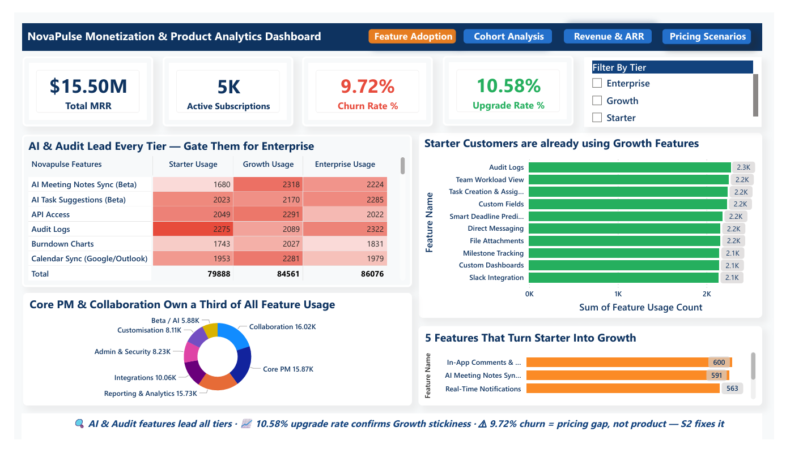
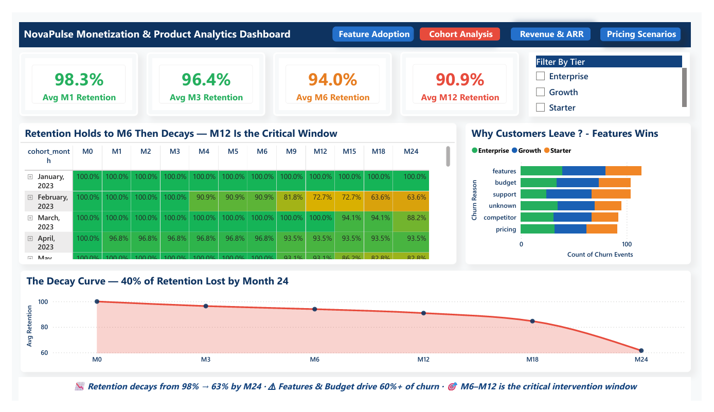
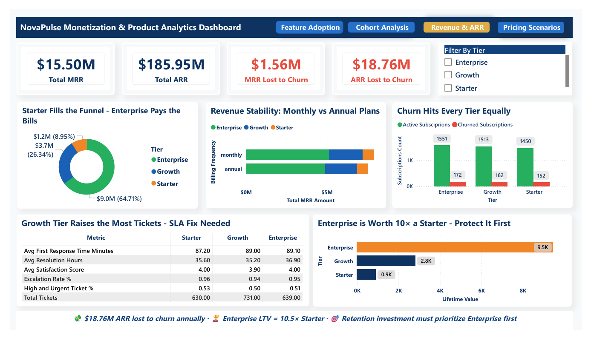
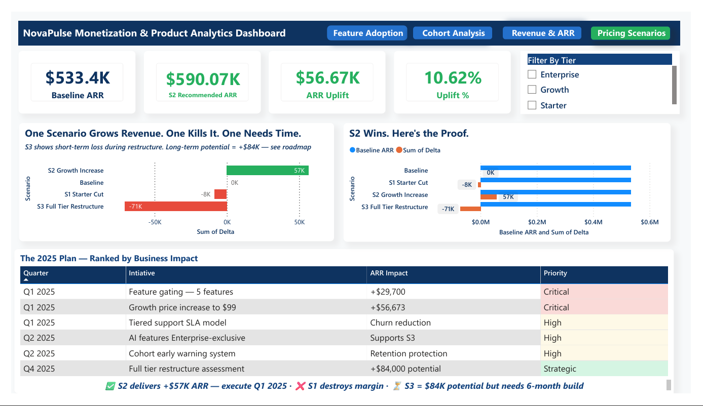
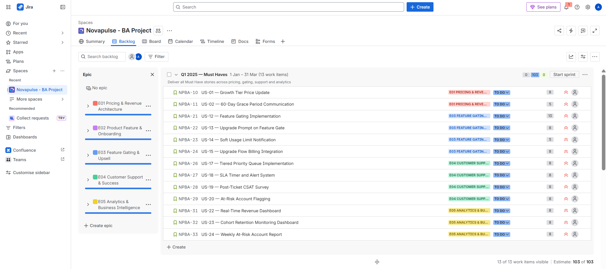
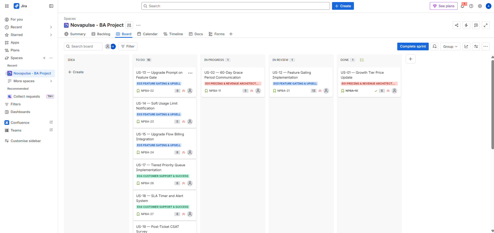
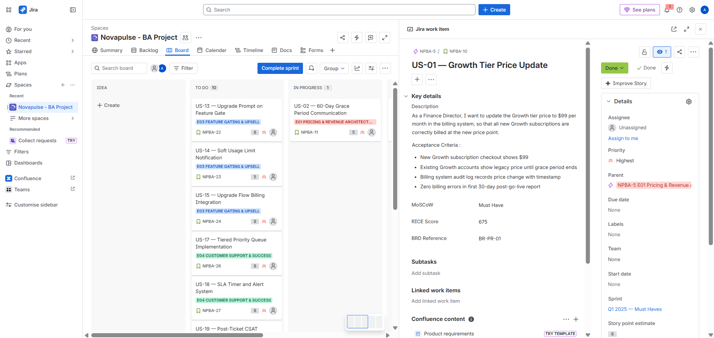
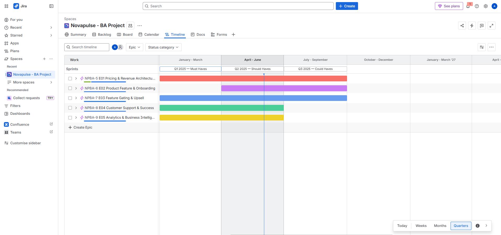

# NovaPulse-BA — B2B SaaS Product Analytics & Monetisation Strategy

> End-to-end Senior BA portfolio · Complete artefact suite (Charter, BRD, Gap Analysis, Agile Backlog, UAT Plan) · Analysed 32,600 rows across 500 accounts · 4-page Power BI dashboard · Solved churn, pricing & feature adoption — uncovering $56,673 ARR uplift (+10.6%)

---

## 🧭 Project Overview

**NovaPulse** is a fictional B2B SaaS project management tool with 500 accounts across 3 pricing tiers. This portfolio project demonstrates end-to-end Senior Business Analyst capability — from raw data ingestion through to boardroom-ready strategy and Agile delivery planning.

|  Detail |  Value |
|---|---|
| 📅 **Project Duration** | 7 Weeks |
| 🏢 **Company** | NovaPulse (Fictional B2B SaaS) |
| 👥 **Accounts** | 500 across 3 tiers |
| 🗃️ **Dataset** | RavenStack Synthetic SaaS by River @ Rivalytics (MIT License) |
| 📊 **Data Volume** | 32,600 rows across 5 CSVs |
| 🛠️ **Tools** | Google Sheets · Power BI · Jira · Google Docs · Canva · GitHub |

---

## 💰 Key Business Outcomes

| 📈 Metric | 💵 Value |
|---|---|
| 📉 Baseline ARR | $533,400 |
| 🚀 Recommended Scenario 2 ARR | $590,073 |
| ✅ **ARR Uplift** | **+$56,673 (+10.6%)** |
| ⚠️ Top Churn Driver | Features (19% of 600 churn events) |
| 📊 Avg M1 Retention | 98.3% vs 75–85% industry benchmark |
| 📊 Avg M12 Retention | 90.9% vs 60–70% industry benchmark |
| 💎 Enterprise LTV | $9,476 — 10.5x Starter LTV of $906 |
| 🔥 Growth Tier Churn Cost | $17,775/month — 10x more than Starter |

---

## 🛠️ Tools & Stack

> 💡 **Python-free stack throughout** — demonstrating that enterprise-grade BA analysis does not require coding skills.

---

## 🗂️ Repository Structure

---

## ✅ Deliverables by Week

### 📌 Week 1 — Project Initiation
- ✅ Project Charter
- ✅ Dataset cleaned — 5 CSVs, 32,600 rows

### 📌 Week 2 — Stakeholder & Context
- ✅ Stakeholder Register with Power/Interest Matrix
- ✅ Business Context Document

### 📌 Week 3 — Analysis
- ✅ Feature Adoption Analysis
- ✅ Cohort Churn Analysis (24 months)
- ✅ Churn Drivers Table
- ✅ Support Analysis Table

### 📌 Week 4 — Strategy & Pricing
- ✅ Pricing Tier Optimisation Model (3 scenarios)
- ✅ Monetisation Strategy Document

### 📌 Week 5 — Requirements
- ✅ Gap Analysis — 15 gaps identified
- ✅ BRD — 24 requirements MoSCoW prioritised

### 📌 Week 6 — Agile Delivery
- ✅ Agile Backlog — 25 user stories · 5 epics · 3 sprints in Jira

### 📌 Week 7 — Delivery & Handover
- ✅ Power BI Dashboard — 4 pages · 20+ DAX measures
- ✅ UAT Plan — 25 test cases across 5 domains
- ✅ Executive Presentation — 12 slides
- ✅ GitHub Repository

---

## 📊 Power BI Dashboard

4-page interactive dashboard built in Power BI Desktop with 20+ DAX measures.

| 📄 Page | 🔍 Focus |
|---|---|
| 📌 Page 1 | Feature Adoption Analysis |
| 📌 Page 2 | Cohort Retention (24 months) |
| 📌 Page 3 | Revenue & ARR Breakdown |
| 📌 Page 4 | Pricing Scenario Modelling |

---

## 🎯 Agile Delivery — Jira

25 user stories across 5 epics and 3 sprints managed in Jira.

| 🎯 Epic | 📋 Focus |
|---|---|
| 🔴 E01 | Pricing & Revenue Architecture |
| 🟣 E02 | Product Feature & Onboarding |
| 🔵 E03 | Feature Gating & Upsell |
| 🟢 E04 | Customer Support & Success |
| 🟡 E05 | Analytics & Business Intelligence |

---

## 💳 Pricing Tiers

| 🏷️ Tier | 💵 Price | 🎯 Focus |
|---|---|---|
| 🥉 Starter | $29/month | SMB accounts |
| 🥈 Growth | $79/month | Mid-market — highest churn cost |
| 🥇 Enterprise | $199/month | Highest LTV at $9,476 |

---

## 📄 Dataset Credit

**RavenStack Synthetic SaaS Dataset**
Created by River @ Rivalytics · Licensed under MIT License
Used solely for portfolio and educational purposes.

---

## 👤 Author

Abinesh - Business Analyst Portfolio Project

---

* This is a portfolio project using synthetic data. NovaPulse is a fictional company created for demonstration purposes.
---
